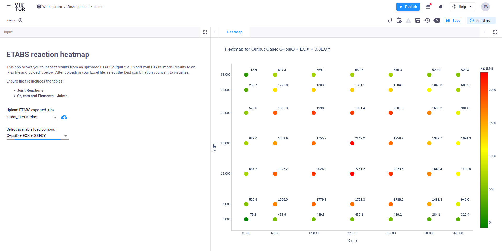

# Process ETABS data

In this tutorial, you will build a VIKTOR app to process and visualize outputs from ETABS. You'll see how to export these outputs from ETABS into a file, upload them into VIKTOR and post-process reaction loads for various load combinations. Along the way, you will work with Plotly and Pandas, using the flexible tools and building blocks that VIKTOR offers.

Here is what we'll cover:

1. Creating an app to take in a file
2. Processing the uploaded .xlsx file exported from ETABS
3. Adding processed data into a field so that the user can select from the results
4. Visualising results based on those selections

By the end of this tutorial, you will be able to generate a heatmap of the reaction loads for your structure by selecting specific load cases. This will allow you to gain valuable insights from your results and easily share them with your clients and team. Additionally, you will learn how to automate this process using VIKTOR. The final result will look like the figure below:

## References
Feel free to check the following [tutorial](https://docs.viktor.ai/docs/tutorials/process-etabs-data/) for a step-by-step guide to make this app yourself.
